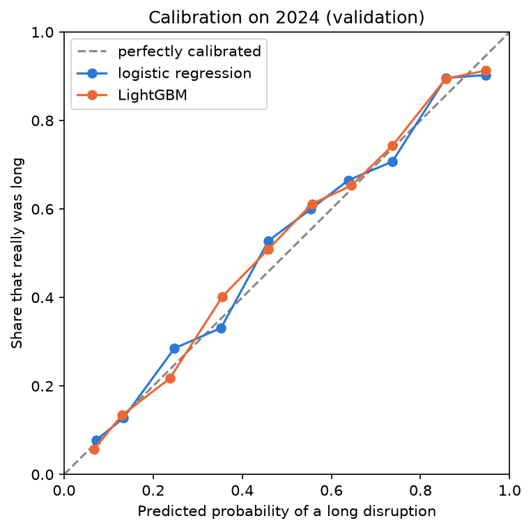
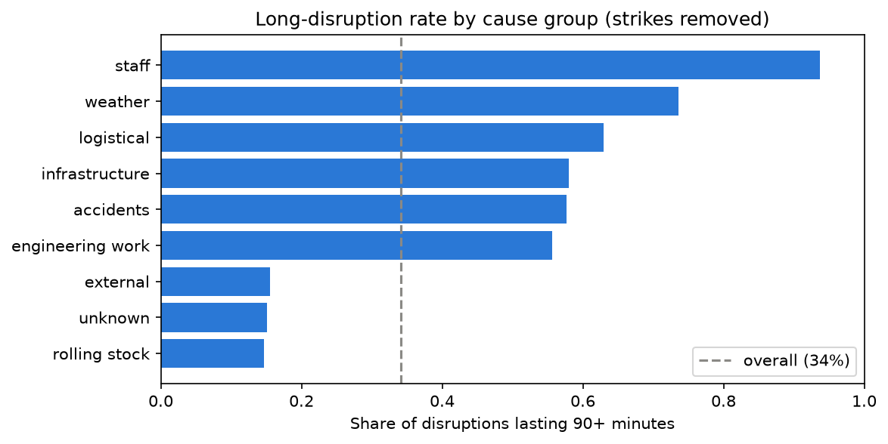
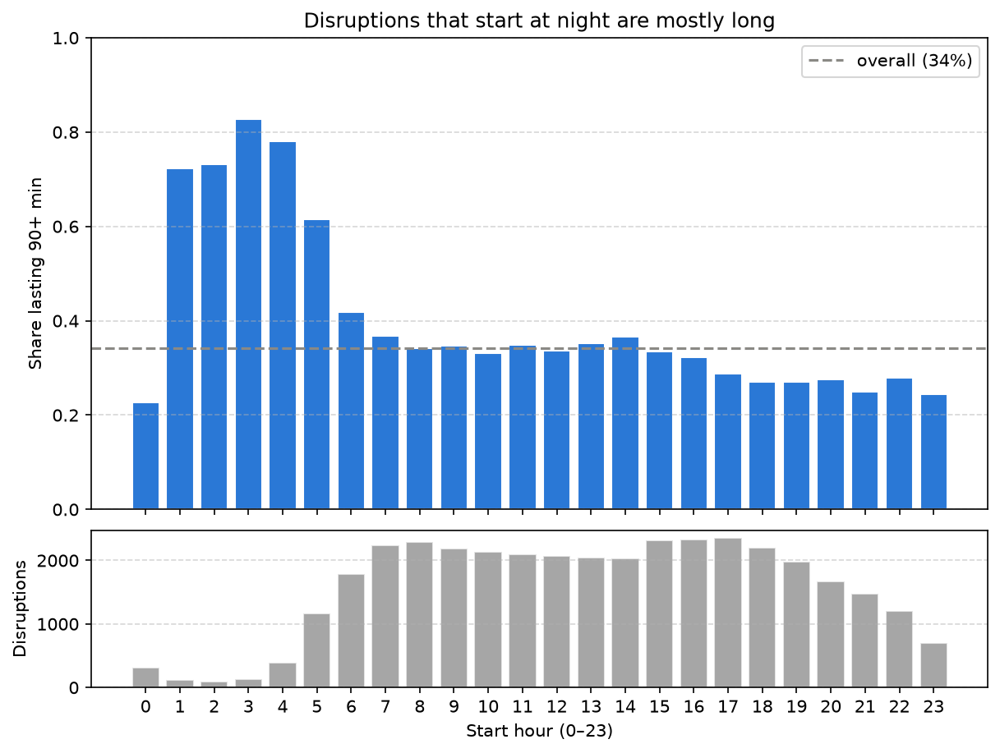

# How long will a Dutch train disruption last?

Predicting, **at the moment a disruption on the Dutch rail network is announced**, whether it will last 90 minutes
or more. Built on seven years (2019–2025) of disruption records from
[Rijden de Treinen](https://www.rijdendetreinen.nl/en/open-data/disruptions), with a strict time-based evaluation:
trained on 2019–2024 and tested once on 2025.

## Results at a glance

| Model (tested on 2025) | ROC-AUC | PR-AUC | Brier score |
|---|---|---|---|
| No model (predicts the average rate) | 0.500 | 0.345 | 0.226 |
| Cause lookup (historical long rate per cause) | 0.823 | 0.701 | 0.149 |
| Logistic regression | 0.833 | 0.733 | 0.148 |
| **LightGBM** | **0.836** | **0.743** | **0.147** |

- **Of the 10% of 2025 disruptions the model rates most likely to be long, 83% really were**, against 34.5% for a
  random pick (about 2.4×) and 74% for the cause lookup.
- **The cause of a disruption does most of the work.** A simple lookup of how often each cause led to a long
  disruption already reaches ROC-AUC 0.82; start hour, affected lines and a more flexible model add a little on top.
- **The predicted probabilities are well calibrated**: when the model says 70%, about 70% of those disruptions
  really are long.

<p align="center"></p>

## The question

When NS announces a disruption, travellers and operations staff have to decide quickly: wait it out, find another
route, or arrange replacement buses. The announcement says *what* happened and *where*, but not *how long* it will
take.

**Using only what is known when a disruption starts (its cause, the lines affected and the time it began), can we
predict whether it will last 90 minutes or more?**

90 minutes was chosen as the point where waiting stops being sensible and travellers would rather reroute. It also
falls in the dip between the two peaks of the duration distribution (quick fixes around 30–50 minutes, real repairs
around 1.5–3 hours), and gives a workable balance: 34.9% of disruptions are long. The threshold was fixed before any
model was trained.

## Data

**Source:** Rijden de Treinen, *Disruptions* open data, one CSV per year, released under
[CC BY 4.0](https://creativecommons.org/licenses/by/4.0/). The data is not stored in this repository; run
`python src/download.py` to fetch it.

**Cleaning** (notebook 01, every decision listed in [`docs/data_quality_log.md`](docs/data_quality_log.md)):

- 38,571 raw records → **37,777** after removing 111 records without a duration (no target) and 683 records that
  were opened and closed within 30 seconds (a recording artefact concentrated in 2019–2020).
- `duration_minutes` is used as the target rather than `end_time − start_time`: the timestamps are local clock time,
  so a naive subtraction is off by 60 minutes for disruptions running through a daylight-saving change.
- Week-long disruptions (strikes, damaged bridges, multi-week works) were checked and kept: they are real events.

**Scope** (notebook 02): **472 strike messages were removed**. A strike is announced in advance, so predicting its
length adds nothing; strikes are also almost always long, so keeping them would have made the model look better than
it is on the disruptions that matter. Staffing shortages, which are not announced in advance, were kept.
**37,305 disruptions** remain.

## What drives long disruptions

<p align="center">
  
  
</p>

- **Cause** is the strongest signal. A person on the track leads to a long disruption 4% of the time, a person hit
  by a train 86%. Broken-down trains (the most common cause) are rarely long; infrastructure, weather and accidents
  often are.
- **Start hour** matters a lot: disruptions starting between 1 and 5 a.m. are long 62–83% of the time, against about
  34% during the day. This holds within the same cause (a broken-down train at night: 80% long, during the day: 15%),
  most likely because a message at night stays open until morning service resumes.
- **Line:** busy Randstad lines are long 23–38% of the time; some regional and cross-border lines in the east around
  70%.
- **Weekday and month** barely matter (3–5 percentage points between the highest and lowest).

## Approach

**Features** (notebook 03), all known at the moment a disruption is announced:

| Feature | Notes |
|---|---|
| Cause | 48 causes; causes with fewer than 30 training rows grouped as "other" |
| Cause group | 9 broad groups (rolling stock, infrastructure, accidents, ...) |
| Start hour | Treated as a category: its effect is not a straight line |
| Weekend flag | Weak, but cheap |
| Lines affected | One 0/1 column per line (103 lines) plus the number of lines |

**Leakage rules.** End time, duration and the "statistical cause" (which can contain the cause established
afterwards) are never used. Record ID, year and the raw timestamp are also excluded: they are known at the start, but
they would let the model learn *when* a disruption happened instead of *what* it was. Every data-dependent choice
(rare causes, kept lines, one-hot categories) is decided on the training years only and then applied unchanged to
later years.

**Evaluation** (notebook 04):

- **Time-based split:** train on 2019–2023 (24,968 disruptions), choose models on 2024 (5,820), then refit on
  2019–2024 and test **once** on 2025 (6,517). A random split would let the model see the same incidents and periods
  in training and testing.
- **Metrics:** ROC-AUC (ranking), PR-AUC (precision among the disruptions flagged as long) and the Brier score
  (quality of the probabilities). Accuracy was not used: always predicting "short" is already 65% accurate.
- **Models:** a no-skill baseline, a cause-lookup baseline, logistic regression (one-hot encoding in a scikit-learn
  pipeline) and LightGBM (six settings compared on 2024). Both models were fixed before the test year was opened.

## Results

**Validation (2024, trained on 2019–2023)**

| Model | ROC-AUC | PR-AUC | Brier |
|---|---|---|---|
| No model | 0.500 | 0.345 | 0.226 |
| Cause lookup | 0.809 | 0.668 | 0.158 |
| Logistic regression | 0.823 | 0.708 | 0.155 |
| LightGBM (15 leaves, 500 trees) | 0.828 | 0.715 | 0.154 |

**Test (2025, trained on 2019–2024)**, with 95% bootstrap intervals:

| Model | ROC-AUC | PR-AUC | Brier |
|---|---|---|---|
| Cause lookup | 0.823 | 0.701 | 0.149 |
| Logistic regression | 0.833 (0.822–0.844) | 0.733 (0.715–0.752) | 0.148 |
| LightGBM | 0.836 (0.825–0.847) | 0.743 (0.724–0.762) | 0.147 |

| Share of flagged disruptions that really were long (2025) | Top 10% | Top 20% |
|---|---|---|
| Cause lookup | 74.4% | 71.4% |
| Logistic regression | 81.4% | 75.2% |
| LightGBM | 82.7% | 77.1% |

**Reading the results**

- Both models clearly beat the cause lookup, which itself is far above chance.
- LightGBM is slightly ahead of logistic regression on every metric in both years, but the gap is small (bootstrap
  difference on 2025: ROC-AUC −0.001 to +0.007, PR-AUC +0.003 to +0.017). Logistic regression is a reasonable, more
  explainable alternative.
- Scores on 2025 are slightly higher than on 2024, most likely because the final models were also trained on 2024,
  which already reflects newer patterns.

## Limitations

- **Changing causes.** Some causes became more often long over time (repair works, damaged railway bridges, signal
  and points failures). The model learns the historical rates and under-predicts these (2025: 63% really long vs 56%
  predicted).
- **"Technical investigation".** NS increasingly publishes this instead of a specific cause (fewer than 10 messages
  a year in 2019–2021, about 300 in 2025). Within this group the model cannot rank disruptions better than chance.
- **What "long" means.** The duration is how long the NS message stayed open, not how long travellers were affected.
  At night a long message may affect few or no travellers.
- **Final versions only.** The data stores the final cause and line list of each message. If NS updated the cause or
  added lines while a disruption was running, only the last version is visible, so the information at announcement
  time may have been slightly less complete than in the data.
- **One row per message.** One incident can produce several messages (different routes, or a message replaced by a
  new one). About 0.6% of messages follow a message with the same cause on the same line within 5 minutes; they were
  not merged.

## Possible next steps

- Merge chains of messages into incidents and predict at incident level.
- Add live context known at the start: other disruptions already running on the same line, or the number of trains
  scheduled in the next hour (Rijden de Treinen also publishes train-service data).
- Retrain regularly, or weight recent years more, to follow causes whose handling changes over time.
- Serve the model behind a small API that scores a new NS announcement.

## Repository structure

```
rail-disruptions-nl/
├── data/                       # not committed; created by src/download.py and the notebooks
│   ├── raw/                    # yearly CSVs as downloaded
│   └── processed/              # disruptions_clean.parquet, model_table.parquet
├── notebooks/
│   ├── 01_load_clean.ipynb     # loading, data checks, cleaning
│   ├── 02_eda.ipynb            # threshold, scope, what drives long disruptions, leakage check
│   ├── 03_features.ipynb       # features and train / validation / test split
│   └── 04_models.ipynb         # baselines, logistic regression, LightGBM, final test
├── docs/
│   └── data_quality_log.md     # every data issue found and the decision taken
├── reports/
│   ├── 04_results.csv          # all validation and test scores
│   └── figures/
├── src/
│   ├── download.py             # downloads the yearly CSVs
│   └── evaluate.py             # ROC-AUC, PR-AUC and Brier score for a model
├── requirements.txt
└── README.md
```

## How to run

```powershell
python -m venv venv
venv\Scripts\Activate.ps1          # on macOS / Linux: source venv/bin/activate
pip install -r requirements.txt
python src/download.py
```

Then run the notebooks in order (01 → 04). Each notebook reads the output of the previous one from `data/processed/`.

## Credits

Disruption data © [Rijden de Treinen](https://www.rijdendetreinen.nl/), released under CC BY 4.0.
